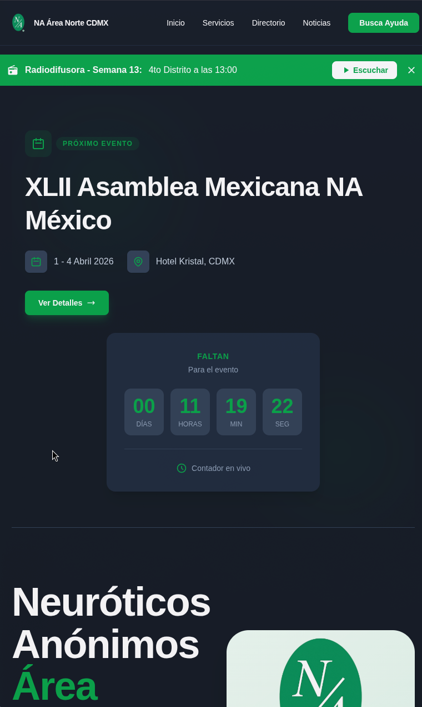

# NA Area Norte CDMX


Sitio web informativo para **Neuróticos Anónimos Área Norte CDMX** — un programa gratuito de 12 pasos para la recuperación emocional.

### Despliegue en: https://na-areanorte-cdmx.vercel.app/ 



## Características

- **Diseño Responsivo** — Interfaz accesible en todos los dispositivos
- **Modo Oscuro** — Tema claro/oscuro con persistencia
- **Blog de Noticias** — Contenido dinámico para eventos y convenciones
- **Directorio de Grupos** — Información de grupos organizados por 5 distritos
- **Mapas Interactivos** — Integración con Google Maps
- **SEO Optimizado** — Meta tags y estructura semántica

## Tecnologías

| Tecnología   | Versión |
| ------------ | ------- |
| Astro        | 5.16.15 |
| React        | 19.2.4  |
| Tailwind CSS | 4.1.18  |
| TypeScript   | -       |

### Dependencias adicionales

- `@astrojs/react` — Integración de React
- `@iconify-json/*` — Sistemas de iconos (Material Symbols + MDI)
- `@tailwindcss/*` — Plugins para Tailwind
- `astro-icon` — Componente de iconos para Astro

## Inicio Rápido

```bash
# Instalar dependencias
pnpm install

# Iniciar servidor de desarrollo
pnpm dev

# Construir para producción
pnpm build

# Previsualizar build local
pnpm preview
```

El servidor de desarrollo estará disponible en `http://localhost:4321`.

## Estructura del Proyecto

```
/
├── public/                  # Assets estáticos
├── src/
│   ├── assets/              # Imágenes y recursos
│   ├── blog/                # Posts del blog (Markdown)
│   ├── components/          # Componentes Astro/React
│   │   ├── Header.astro
│   │   ├── Footer.astro
│   │   ├── Directorio.tsx
│   │   └── MobileMenu.jsx
│   ├── content.config.ts    # Configuración de Content Collections
│   ├── data/
│   │   └── grupos/          # Datos JSON de grupos por distrito
│   ├── layouts/             # Layouts de página
│   │   ├── Layout.astro
│   │   └── MarkdownPostLayout.astro
│   ├── pages/               # Rutas del sitio
│   │   ├── index.astro
│   │   ├── noticias.astro
│   │   ├── directorio.astro
│   │   ├── servicios.astro
│   │   └── contacto.astro
│   ├── styles/              # Estilos globales
│   ├── types/               # Definiciones TypeScript
│   └── utils/               # Funciones utilitarias
├── astro.config.mjs
├── tailwind.config.ts
├── tsconfig.json
└── package.json
```

## Secciones del Sitio

| Página         | Descripción                                                   |
| -------------- | ------------------------------------------------------------- |
| **Inicio**     | Mensaje principal, noticias recientes, mapa y contacto        |
| **Noticias**   | Blog con eventos, convenciones y etiquetas categorizadas      |
| **Directorio** | Grupos organizados por 5 distritos con horarios y ubicaciones |
| **Servicios**  | Programa de 12 pasos y recursos de recuperación               |
| **Contacto**   | Formulario, ubicación y medios de contacto                    |

## Gestión de Contenido

El sitio utiliza **Astro Content Collections** para:

- **Blog**: Posts en Markdown con frontmatter tipado
- **Grupos**: Datos JSON validados por distrito
- **TypeScript**: Tipado estático para todo el contenido

## Diseño

- **Paleta**: Colores primarios verdes para identidad institucional
- **Tipografía**: Sistema jerárquico para legibilidad
- **Iconografía**: Material Symbols y MDI
- **Responsive**: Mobile-first con breakpoints optimizados

## Despliegue

Compatible con plataformas de hosting estático:

- Vercel
- Netlify
- GitHub Pages
- Cloudflare Pages

## Licencia

Proyecto desarrollado para Neuróticos Anónimos Área Norte CDMX.
